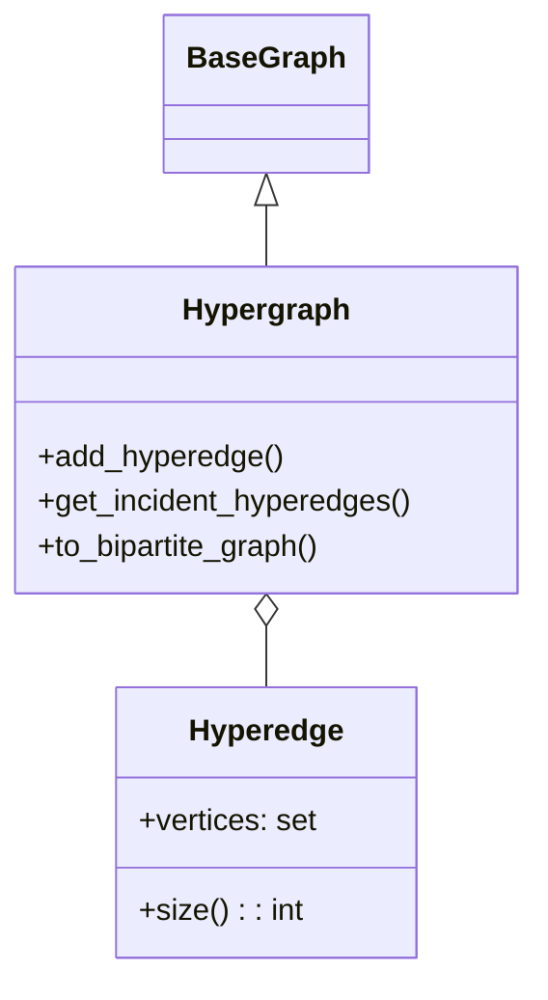

# Гіперграф (Hypergraph)

## 1. Вступ

**Hypergraph (Гіперграф)** — це узагальнення графа, в якому ребро (називається **гіперребром**) може з'єднувати будь-яку кількість вершин, а не тільки дві.

Гіперграфи є потужним інструментом для моделювання складних відносин "багато-до-багатьох", які неможливо природним чином представити звичайними графами без втрати семантики. Вони широко використовуються в аналізі баз даних, біології (взаємодія білків), соціальних науках (групи людей) та при проектуванні надвеликих інтегральних схем (VLSI).

## 2. Математичне визначення

Гіперграф $H$ — це пара $(V, E)$, де:
- $V$ — множина вершин.
- $E$ — множина непорожніх підмножин $V$, які називаються **гіперребрами**.

Тобто, кожне $e \in E$ є підмножиною вершин: $e \subseteq V, e \neq \emptyset$.

**Відмінності від звичайних графів:**
- У звичайному графі $|e| = 2$ для всіх ребер.
- У гіперграфі $|e|$ може бути будь-яким числом $k \ge 1$.
- Гіперребро розміром $|e|=1$ є аналогом петлі.
- Гіперребро розміром $|e|=2$ є аналогом звичайного ребра.

## 3. Архітектура реалізації

Клас `Hypergraph` має найбільш відмінну реалізацію серед усіх типів графів у бібліотеці.

### Структура даних
Внутрішнє представлення реалізоване через `HypergraphRepresentation`.

1.  **Гіперребра (`Hyperedge`)**:
    -   Окремий клас, що зберігає `frozenset` вершин (для забезпечення незмінності та хешування).
    -   Має власні атрибути (вага, метадані).
2.  **Зберігання**:
    -   `_hyperedges`: Словник `dict[HyperedgeID, Hyperedge]`.
    -   `_incidence`: Словник інцидентності `dict[VertexID, set[HyperedgeID]]`. Зіставляє кожній вершині набір ID гіперребер, до яких вона входить. Це дозволяє швидко знаходити всі зв'язки вершини ($O(1)$ в середньому).

Діаграма класів:


## 4. API та функціонал

### Конструктор

#### `__init__(self, **kwargs: Any) -> None`
Ініціалізує гіперграф.
*   **Примітка:** Гіперграфи завжди розглядаються як **неорієнтовані** в даній реалізації (`directed=False`).

### Додавання елементів

#### `add_hyperedge(self, vertices: set[Any] | list[Any], *, weight: float = 1.0, **attributes: Any) -> None`
Основний метод додавання зв'язків.

*   **Параметри:**
    *   `vertices` (set | list): Набір ID вершин, які будуть з'єднані цим гіперребром. Має містити щонайменше 2 вершини (хоча технічно код дозволяє і 1).
    *   `weight`, `attributes`: Стандартні параметри.
*   **Приклад:** `graph.add_hyperedge({"A", "B", "C"})` створює один зв'язок, що об'єднує трьох учасників.
*   **Складність:** $O(|e|)$, де $|e|$ — розмір гіперребра (кількість вершин у ньому).

#### `add_edge(self, source, target, ...)`
Сумісний метод для додавання звичайного ребра (гіперребра розміром 2).

### Видалення елементів

#### `remove_vertex(self, vertex_id: Any) -> None`
Видаляє вершину та **всі** гіперребра, до яких вона входила. Навіть якщо в гіперребрі залишалися інші вершини, воно видаляється повністю (оскільки змінюється його склад, а отже і сутність).

### Запити та аналіз

#### `get_incident_hyperedges(self, vertex_id: Any) -> set[Hyperedge]`
Повертає всі гіперребра, в яких бере участь дана вершина.
*   **Аналог:** `get_edges` у звичайних графах.

#### `get_neighbors(self, vertex_id: Any) -> set[Any]`
Повертає множину вершин, які є "сусідами" даної.
*   **Визначення сусідства:** Дві вершини є сусідами, якщо вони входять до складу хоча б одного спільного гіперребра.
*   **Складність:** Залежить від кількості гіперребер та їх розміру.

#### `has_edge(self, source: Any, target: Any) -> bool`
Перевіряє наявність **саме бінарного** гіперребра $\{source, target\}$. Не поверне `True`, якщо ці вершини з'єднані лише в складі більшої групи (наприклад, $\{source, target, C\}$).

### Конвертація

#### `to_bipartite_graph(self) -> SimpleGraph`
Перетворює гіперграф на звичайний двочастковий граф (біграф), де:
-   Одна частка вершин відповідає оригінальним вершинам гіперграфа.
-   Друга частка вершин відповідає гіперребрам.
-   Ребра з'єднують вершину $v$ з вершиною-гіперребром $e$, якщо $v \in e$.

Це стандартний математичний спосіб зведення задач на гіперграфах до задач на звичайних графах.

## 5. Практичні приклади використання (Use Cases)

### Сценарій 1: Співавторство наукових статей

Стаття може мати 1, 2, 3 або 10 авторів. Гіперребро представляє одну статтю, а вершини — авторів.

```python
from packages.graphs.hypergraph import Hypergraph

coauthorship = Hypergraph()

# Автори
coauthorship.add_vertex("Scientist A")
coauthorship.add_vertex("Scientist B")
coauthorship.add_vertex("Scientist C")

# Стаття 1 (написана втрьох)
coauthorship.add_hyperedge(
    {"Scientist A", "Scientist B", "Scientist C"}, 
    title="Graph Theory 101"
)

# Стаття 2 (написана вдвох)
coauthorship.add_hyperedge(
    {"Scientist A", "Scientist B"}, 
    title="Advanced Usage"
)

# З ким співпрацював A?
print(f"Колеги A: {coauthorship.get_neighbors('Scientist A')}")
# Результат: {'Scientist B', 'Scientist C'}
```

### Сценарій 2: Групи користувачів у чатах

Груповий чат об'єднує багато користувачів. Чат — це гіперребро.

```python
chat_system = Hypergraph()
chat_system.add_vertex("User1")
chat_system.add_vertex("User2")
chat_system.add_vertex("User3")

# Група "Робота"
chat_system.add_hyperedge({"User1", "User2", "User3"}, name="Work")

# Приватний чат
chat_system.add_hyperedge({"User1", "User2"}, name="Private")

# У скількох чатах бере участь User1?
print(f"Кількість чатів: {chat_system.degree('User1')}") # 2
```

## 6. Best Practices

1.  **Використовуйте `Hyperedge` атрибути:** Оскільки гіперребро — це складний об'єкт, активно використовуйте словник `attributes` для зберігання контексту (назва групи, дата публікації тощо).
2.  **Біпартитне представлення:** Якщо вам потрібно застосувати стандартний алгоритм (наприклад, потік в мережі) до гіперграфа, спочатку конвертуйте його через `to_bipartite_graph()`. Більшість алгоритмів бібліотеки (`bfs`, `dfs`) адаптовані для гіперграфів, але специфічні можуть не працювати.
3.  **Не плутайте сусідство:** Пам'ятайте, що `get_neighbors` поверне всіх членів всіх груп, в яких є вершина. Це може бути дуже велика множина.

## 7. Обробка помилок та винятки

```python
hyper = Hypergraph()
hyper.add_vertex("A")

try:
    # Спроба додати гіперребро з невідомою вершиною
    hyper.add_hyperedge({"A", "Unknown"})
except KeyError:
    print("Всі вершини мають бути додані заздалегідь!")

# Важливо: Hypergraph не підтримує методи видалення звичайних ребер
try:
    hyper.remove_edge("A", "B")
except NotImplementedError:
    print("Використовуйте remove_hyperedge() та ID ребра")
```

## 8. Порівняння з іншими типами графів

| Характеристика | Simple/Pseudo/Multi Graph | Hypergraph |
|----------------|---------------------------|------------|
| **Зв'язність** | Тільки пари (2 вершини)  | Довільна підмножина ($k \ge 1$) |
| **Ребра**      | `Edge` (source, target)   | `Hyperedge` (set of vertices) |
| **Сусідство**  | Прямий зв'язок            | Участь у спільній групі |

## 9. Посилання

*   [Wolfram MathWorld: Hypergraph](https://mathworld.wolfram.com/Hypergraph.html)
*   [Wikipedia: Hypergraph](https://en.wikipedia.org/wiki/Hypergraph)
