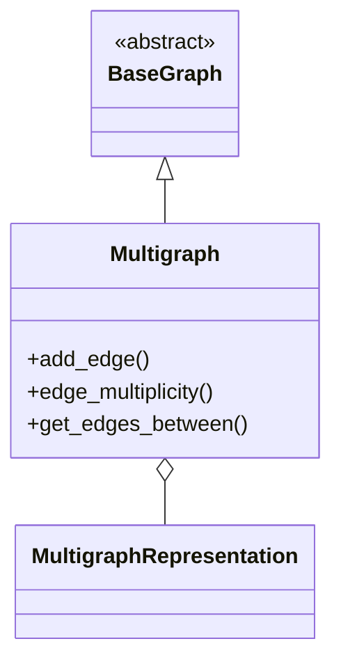

# Мультиграф (Multigraph)

## 1. Вступ

**Multigraph (Мультиграф)** — розширена версія простого графа, яка дозволяє наявність кратних (паралельних) ребер між двома вершинами, але забороняє петлі (ребра, що з'єднують вершину саму з собою).

Цей тип графа ідеально підходить для моделювання систем, де між двома об'єктами може існувати кілька незалежних зв'язків. Наприклад, у телекомунікаціях між двома дата-центрами прокладено кілька окремих оптоволоконних ліній, або в авіації — кілька рейсів різних авіакомпаній між двома аеропортами.

## 2. Математичне визначення

Мультиграф $G$ визначається як впорядкована трійка $(V, E, \phi)$, де:
- $V$ — множина вершин.
- $E$ — множина ребер (вони є унікальними об'єктами).
- $\phi: E \to \{\{u, v\} \mid u, v \in V, u \neq v\}$ — функція інцидентності, яка зіставляє кожному ребру пару вершин.

**Ключові особливості:**
1.  **Кратні ребра дозволені:** Можуть існувати $e_1, e_2 \in E$, такі що $e_1 \neq e_2$, але $\phi(e_1) = \phi(e_2)$.
2.  **Петлі заборонені:** $\phi(e)$ ніколи не дорівнює $\{v, v\}$. Тобто кожне ребро з'єднує *різні* вершини.

## 3. Архітектура реалізації

Клас `Multigraph` є безпосереднім спадкоємцем `BaseGraph`.

### Структура даних
Реалізація використовує спеціалізовану стратегію `MultigraphRepresentation`, оскільки стандартні списки суміжності для простих графів не розраховані на дублікати зв'язків.

-   **Список суміжності (`adjacency_list`)**:
    -   Словник `_adj_list`: `dict[VertexID, list[VertexID]]`. Значення — це список, що може містити повтори ID сусідів.
    -   Словник `_edges`: `dict[EdgeID, Edge]`. Зберігає об'єкти ребер, дозволяючи їм мати різні атрибути (вагу, мітки) навіть при однакових кінцевих точках.
-   **Обмеження:** На даний момент `Multigraph` підтримує лише `adjacency_list` як спосіб внутрішнього представлення, оскільки матриця суміжності погано підходить для зберігання інформації про конкретні екземпляри паралельних ребер.

Діаграма класів:


## 4. API та функціонал

### Конструктор

#### `__init__(self, *, directed: bool = False, **kwargs: Any) -> None`
Створює новий мультиграф.
*   **Параметри:** Ті ж, що і в `SimpleGraph`.
*   **Примітка:** Параметр `representation` зафіксовано на рівні "adjacency_list".

### Додавання елементів

#### `add_edge(self, source: Any, target: Any, *, weight: float = 1.0, **attributes: Any) -> None`
Додає ребро. Дозволяє додавати нове ребро, навіть якщо ідентичне вже існує.

*   **Параметри:** Стандартні для всіх графів.
*   **Обробка помилок:**
    *   `GraphConstraintError`: Якщо `source == target` (спроба додати петлю).
    *   **Немає помилки** при дублюванні зв'язку.

### Робота з кратними ребрами

#### `edge_multiplicity(self, source: Any, target: Any) -> int`
Повертає кількість ребер між двома вершинами.
*   **Складність:** $O(|E|)$ — лінійний перебір у поточній реалізації.
*   **Повертає:** Число паралельних ребер ($\ge 0$).

#### `get_edges_between(self, source: Any, target: Any) -> list[Edge]`
Повертає список всіх об'єктів ребер, що з'єднують вказану пару вершин.
*   **Повертає:** Список об'єктів `Edge`.
*   **Приклад:** `[Edge(A->B, w=5), Edge(A->B, w=3)]`.

#### `get_edge(self, source: Any, target: Any) -> Edge`
Повертає **перше знайдене** ребро між вершинами.
*   **Попередження:** Якщо ребер кілька, не гарантується, яке саме повернеться. Використовуйте `get_edges_between`, якщо важлива конкретика.

### Властивості

#### `edge_count(self) -> int`
Повертає загальну кількість ребер, враховуючи всі дублікати.

#### `get_neighbors(self, vertex_id: Any) -> set[Any]`
Повертає множину **унікальних** сусідів. Навіть якщо до сусіда веде 5 ребер, він буде в множині один раз.

## 5. Практичні приклади використання (Use Cases)

### Сценарій 1: Транзакції між банківськими рахунками

Користувачі можуть робити кілька переказів один одному. Кожен переказ — це окреме ребро з атрибутом суми та дати.

```python
from packages.graphs.multigraph import Multigraph

bank_graph = Multigraph(directed=True)

# Клієнти
bank_graph.add_vertex("User1")
bank_graph.add_vertex("User2")

# Транзакції (паралельні ребра)
bank_graph.add_edge("User1", "User2", weight=100.0, date="2023-10-01")
bank_graph.add_edge("User1", "User2", weight=50.0, date="2023-10-05")

# Аналіз
transactions = bank_graph.get_edges_between("User1", "User2")
total_amount = sum(e.weight for e in transactions)
print(f"Всього переказів: {len(transactions)}") # 2
print(f"Загальна сума: {total_amount}")         # 150.0
```

### Сценарій 2: Комп'ютерна мережа з резервуванням каналів

```python
network = Multigraph(directed=False)
network.add_vertex("ServerA")
network.add_vertex("ServerB")

# Основний канал 10Gbps
network.add_edge("ServerA", "ServerB", weight=10000, type="fiber_main")
# Резервний канал 1Gbps
network.add_edge("ServerA", "ServerB", weight=1000, type="fiber_backup")

print(f"Кількість ліній зв'язку: {network.edge_multiplicity('ServerA', 'ServerB')}")
# Очікуваний результат: 2
```

## 6. Best Practices

1.  **Використовуйте атрибути:** Оскільки ребра можуть бути паралельними, розрізняти їх часто доводиться за атрибутами (наприклад, ID транзакції, тип кабелю, номер рейсу).
2.  **Обережно з видаленням:** Метод `remove_edge(u, v)` видаляє **одне** (перше знайдене) ребро. Якщо ви хочете видалити конкретне ребро або всі ребра між парою, вам доведеться ітеруватися вручну або реалізувати специфічну логіку.
3.  **Пам'ять:** Мультиграф споживає більше пам'яті, оскільки зберігає кожен екземпляр ребра як окремий об'єкт.

## 7. Обробка помилок та винятки

Мультиграф суворіший за псевдограф, але "добріший" за простий граф.

```python
graph = Multigraph()
graph.add_vertex("A")
graph.add_vertex("B")

# Це нормально
graph.add_edge("A", "B")
graph.add_edge("A", "B")

try:
    # Це помилка (петлі заборонені)
    graph.add_edge("A", "A")
except GraphConstraintError as e:
    print(f"Помилка: {e}") 
    # Виведе: Multigraphs cannot contain self-loops: 'A'
```

## 8. Порівняння з іншими типами графів

| Характеристика | Simple Graph | Pseudograph | Multigraph | Hypergraph |
|----------------|--------------|-------------|------------|------------|
| **Кратні ребра** | ❌ Ні        | ✅ Так       | ✅ Так      | ❌ Ні      |
| **Петлі**        | ❌ Ні        | ✅ Так       | ❌ Ні       | ❌ Ні      |
| **Ідентифікація ребер** | За парою вершин | За унікальним ID | За унікальним ID | За множиною вершин |

## 9. Посилання

*   [Wolfram MathWorld: Multigraph](https://mathworld.wolfram.com/Multigraph.html)
*   [Wikipedia: Multigraph](https://en.wikipedia.org/wiki/Multigraph)
