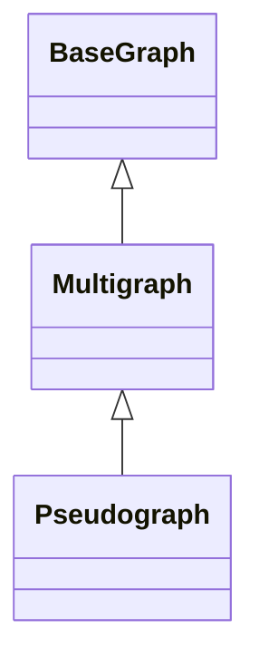

# Псевдограф (Pseudograph)

## 1. Вступ

**Pseudograph (Псевдограф)** — це найбільш загальний тип графа в класичній теорії графів, який дозволяє як наявність петель (ребер, що з'єднують вершину саму з собою), так і кратних (паралельних) ребер між однією парою вершин.

Цей тип графа є незамінним при моделюванні складних систем, де об'єкти можуть мати внутрішні стани або процеси (петлі) та безліч каналів взаємодії (кратні ребра). Приклади включають транспортні мережі (кілька рейсів між містами, екскурсійні маршрути по колу), молекулярну хімію або скінченні автомати.

## 2. Математичне визначення

Псевдограф $G$ визначається як впорядкована трійка $(V, E, \phi)$, де:
- $V$ — множина вершин.
- $E$ — множина ребер.
- $\phi: E \to \{\{u, v\} \mid u, v \in V\}$ — функція інцидентності, яка зіставляє кожному ребру пару вершин (впорядковану для орієнтованого графа).

**Ключові особливості:**
1.  **Петлі дозволені:** Можливо, що $\phi(e) = \{v, v\}$, тобто ребро з'єднує вершину з нею ж самою.
2.  **Кратні ребра дозволені:** Можуть існувати $e_1, e_2 \in E$, такі що $e_1 \neq e_2$, але $\phi(e_1) = \phi(e_2)$.

## 3. Архітектура реалізації

Клас `Pseudograph` успадковується від класу `Multigraph` (який, у свою чергу, наслідує `BaseGraph`), розширюючи його можливості дозволом на створення петель.

### Структура даних
Внутрішнє представлення базується на **Мультиграфовому списку суміжності**:
-   Використовується `MultigraphRepresentation`.
-   Ребра зберігаються як об'єкти з унікальними ID, що дозволяє розрізняти паралельні ребра (навіть якщо вони мають однакові ваги).
-   Словник суміжності `_adj_list` зберігає списки сусідів, де один і той же сусід може зустрічатися кілька разів.

Діаграма спадкування:


## 4. API та функціонал

`Pseudograph` наслідує всі методи `Multigraph`, перевизначаючи перевірки обмежень.

### Додавання елементів

#### `add_edge(self, source: Any, target: Any, *, weight: float = 1.0, **attributes: Any) -> None`
Додає ребро. На відміну від `SimpleGraph` та `Multigraph`, цей метод **дозволяє** `source == target` (петлі).

*   **Параметри:** Аналогічні базовим графам.
*   **Особливість:** Не викидає `GraphConstraintError` при спробі додати петлю. Дозволяє додавати ідентичні ребра багаторазово.

### Специфічні методи для петель

#### `has_self_loop(self, vertex_id: Any) -> bool`
Перевіряє, чи має вказана вершина хоча б одну петлю.
*   **Складність:** $O(\text{deg}(v))$, де ми перевіряємо всі інцидентні ребра.

#### `self_loop_count(self, vertex_id: Any) -> int`
Рахує кількість петель для конкретної вершини.
*   **Повертає:** Ціле число $\ge 0$.

#### `count_self_loops(self) -> int`
Рахує загальну кількість петель у всьому графі.
*   **Складність:** $O(|E|)$.

#### `remove_all_self_loops(self) -> int`
Видаляє всі петлі з графа. Зручно для конвертації псевдографа в мультиграф.
*   **Повертає:** Кількість видалених ребер.

### Розрахунок степенів

#### `total_degree(self, vertex_id: Any) -> int`
Розраховує повний степінь вершини згідно з правилами теорії графів:
-   Кожне звичайне ребро додає 1 до степеня.
-   **Кожна петля додає 2 до степеня** (оскільки вона інцидентна вершині "двічі").

Формула: $\text{deg}_{total}(v) = \text{deg}_{neighbors}(v) + 2 \times \text{count}_{loops}(v)$.

## 5. Практичні приклади використання (Use Cases)

### Сценарій 1: Аналіз станів скінченного автомата (FSM)

Автомати часто мають стани, які переходять самі в себе при певних вхідних сигналах.

```python
from packages.graphs.pseudograph import Pseudograph

fsm = Pseudograph(directed=True)

# Стани
fsm.add_vertex("Idle")
fsm.add_vertex("Processing")
fsm.add_vertex("Error")

# Переходи
fsm.add_edge("Idle", "Processing", label="start_job")
# Петля: продовжуємо обробку
fsm.add_edge("Processing", "Processing", label="tick") 
fsm.add_edge("Processing", "Error", label="failure")
# Петля: залишаємось в помилці до скидання
fsm.add_edge("Error", "Error", label="retry_failed") 
fsm.add_edge("Error", "Idle", label="reset")

print(f"Чи є цикл в 'Processing'? {fsm.has_self_loop('Processing')}")
```

### Сценарій 2: Транспортна логістика

Моделювання автобусних маршрутів, включаючи кільцеві маршрути по місту.

```python
city_transport = Pseudograph(directed=False)
city_transport.add_vertex("CentralStation")

# Кільцевий маршрут №1 (починається і закінчується на вокзалі)
city_transport.add_edge("CentralStation", "CentralStation", 
                        route="Bus 1", distance=10.5)

# Інший кільцевий екскурсійний маршрут
city_transport.add_edge("CentralStation", "CentralStation", 
                        route="Tour Bus", distance=5.0)

print(f"Кількість кільцевих маршрутів: {city_transport.self_loop_count('CentralStation')}")
```

## 6. Best Practices

1.  **Облік петель у алгоритмах:** Пам'ятайте, що стандартні алгоритми (наприклад, BFS/DFS) можуть потребувати адаптації. Петлі можуть призводити до нескінченних циклів, якщо не відслідковувати відвідані вершини коректно. Бібліотека обробляє це, але при написанні власних обходів будьте уважні.
2.  **Візуалізація:** При візуалізації псевдографів важливо коректно відображати кратні петлі, щоб вони не накладалися одна на одну.
3.  **Конвертація:** Якщо вам потрібно запустити алгоритм, який не підтримує петлі (наприклад, деякі варіації найкоротшого шляху), використовуйте метод `remove_all_self_loops()` перед запуском.

## 7. Обробка помилок та винятки

`Pseudograph` — це найбільш "ліберальний" тип, тому він майже не викидає помилок обмежень (`GraphConstraintError`).

```python
pseudo = Pseudograph()
pseudo.add_vertex("A")

# Це працює (в SimpleGraph була б помилка)
pseudo.add_edge("A", "A") 
pseudo.add_edge("A", "A") # Дублікат теж дозволений

# Основні помилки пов'язані з відсутністю даних
try:
    pseudo.add_edge("A", "Ghost")
except VertexNotFoundError:
    print("Вершина не знайдена!")
```

## 8. Порівняння з іншими типами графів

| Характеристика | Simple Graph | Pseudograph | Multigraph | Hypergraph |
|----------------|--------------|-------------|------------|------------|
| **Кратні ребра** | ❌ Ні        | ✅ Так       | ✅ Так      | ❌ Ні      |
| **Петлі**        | ❌ Ні        | ✅ Так       | ❌ Ні       | ❌ Ні      |
| **Степінь вершини** | К-сть сусідів | Сусіди + 2*Петлі | К-сть ребер | К-сть гіперребер |

## 9. Посилання

*   [Wolfram MathWorld: Pseudograph](https://mathworld.wolfram.com/Pseudograph.html)
*   [Introduction to Graph Theory (West)](https://www.math.uiuc.edu/~west/igt/)
