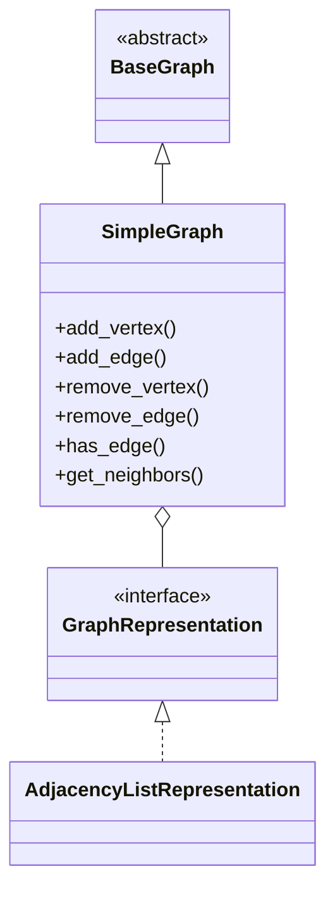

# Простий Граф (Simple Graph)

## 1. Вступ

**Simple Graph (Простий граф)** — це базова структура даних у теорії графів, яка представляє собою сукупність вершин та ребер, де кожне ребро з'єднує пару унікальних вершин.

Цей тип графа є фундаментальним будівельним блоком для моделювання багатьох реальних систем, таких як соціальні мережі (дружба між людьми), комп'ютерні мережі (з'єднання між серверами) або дорожні карти (дороги між містами), де зв'язок між об'єктами є однозначним і не передбачає "самозамикання".

Основна область застосування включає задачі пошуку шляху, аналіз зв'язності, топологічне сортування та багато інших класичних алгоритмічних проблем.

## 2. Математичне визначення

Формально простий граф $G$ визначається як пара $(V, E)$, де:
- $V$ — непорожня скінченна множина вершин (вузлів).
- $E$ — множина ребер, що є підмножиною декартового добутку $V \times V$ (для орієнтованих графів) або множиною невпорядкованих пар $\{u, v\}$, де $u, v \in V$ та $u \neq v$.

**Основні обмеження:**
1.  **Відсутність петель:** Ребро не може з'єднувати вершину саму з собою. Тобто, $(v, v) \notin E$ для будь-якого $v \in V$.
2.  **Відсутність кратних ребер:** Між будь-якою парою вершин може існувати не більше одного ребра (в одному напрямку для орієнтованих графів).

Математична нотація:
$$ G = (V, E), \quad E \subseteq \{\{u, v\} \mid u, v \in V, u \neq v\} $$

## 3. Архітектура реалізації

Клас `SimpleGraph` успадковується від абстрактного базового класу `BaseGraph`.

### Структура даних
Реалізація підтримує різні стратегії внутрішнього представлення графа, що обираються під час ініціалізації:
-   **Список суміжності (`adjacency_list`)** _(за замовчуванням)_:
    -   Використовує словник `dict[VertexID, list[VertexID]]`.
    -   Ефективний для розріджених графів.
    -   Просторова складність: $O(|V| + |E|)$.
-   **Матриця суміжності (`adjacency_matrix`)**:
    -   Використовує двовимірний масив (або список списків).
    -   Ефективний для густих графів.
    -   Просторова складність: $O(|V|^2)$.
-   **Список ребер (`edge_list`)**:
    -   Зберігає лише список об'єктів ребер.
    -   Мінімальні витрати пам'яті, але повільніший доступ до сусідів.
    -   Просторова складність: $O(|E|)$.

Вершини та ребра представлені об'єктами класів `Vertex` та `Edge` відповідно, що дозволяє зберігати додаткові атрибути (вагу, мітки, метадані).

Діаграма класів:


## 4. API та функціонал

### Конструктор

#### `__init__(self, *, directed: bool = False, representation: str = "adjacency_list", **kwargs: Any) -> None`
Ініціалізує новий простий граф.

*   **Параметри:**
    *   `directed` (bool): Чи є граф орієнтованим. За замовчуванням `False`.
    *   `representation` (str): Тип внутрішнього представлення (`"adjacency_list"`, `"adjacency_matrix"`, `"edge_list"`). За замовчуванням `"adjacency_list"`.
    *   `**kwargs`: Додаткові метадані графа.

### Додавання елементів

#### `add_vertex(self, vertex_id: Any, **attributes: Any) -> None`
Додає нову вершину до графа.

*   **Параметри:**
    *   `vertex_id` (Any): Унікальний ідентифікатор вершини.
    *   `**attributes`: Довільні атрибути вершини (наприклад, `color="red"`).
*   **Складність:** $O(1)$ для списку суміжності, $O(|V|^2)$ для матриці (при розширенні).
*   **Обробка помилок:** Викидає `ValueError`, якщо вершина з таким ID вже існує.

#### `add_edge(self, source: Any, target: Any, *, weight: float = 1.0, **attributes: Any) -> None`
Додає ребро між двома вершинами.

*   **Параметри:**
    *   `source` (Any): ID початкової вершини.
    *   `target` (Any): ID кінцевої вершини.
    *   `weight` (float): Вага ребра. За замовчуванням `1.0`.
    *   `**attributes`: Довільні атрибути ребра.
*   **Складність:** $O(1)$.
*   **Обробка помилок:**
    *   `GraphConstraintError`: Якщо `source == target` (спроба створити петлю).
    *   `ValueError`: Якщо таке ребро вже існує.
    *   `VertexNotFoundError`: Якщо одна з вершин не існує.

### Видалення елементів

#### `remove_vertex(self, vertex_id: Any) -> None`
Видаляє вершину та всі інцидентні їй ребра.

*   **Параметри:**
    *   `vertex_id` (Any): ID вершини для видалення.
*   **Складність:** $O(\text{deg}(v))$ для списку суміжності, $O(|V|^2)$ для матриці.
*   **Обробка помилок:** `VertexNotFoundError`, якщо вершина не знайдена.

#### `remove_edge(self, source: Any, target: Any) -> None`
Видаляє ребро між вершинами.

*   **Параметри:**
    *   `source` (Any): Початкова вершина.
    *   `target` (Any): Кінцева вершина.
*   **Складність:** $O(1)$.
*   **Обробка помилок:** `KeyError`, якщо ребро не існує.

### Отримання інформації

#### `has_vertex(self, vertex_id: Any) -> bool`
Перевіряє наявність вершини.
*   **Складність:** $O(1)$.

#### `has_edge(self, source: Any, target: Any) -> bool`
Перевіряє наявність ребра.
*   **Складність:** $O(1)$ для списків/матриці суміжності.

#### `get_neighbors(self, vertex_id: Any) -> set[Any]`
Повертає множину сусідніх вершин.
*   **Складність:** $O(1)$ для списку суміжності, $O(|V|)$ для матриці.

### Конвертація

#### `to_multigraph(self) -> Multigraph`
Перетворює на мультиграф (дозволяє додавати паралельні ребра в майбутньому).

#### `to_pseudograph(self) -> Pseudograph`
Перетворює на псевдограф (дозволяє петлі та паралельні ребра).

## 5. Практичні приклади використання (Use Cases)

### Сценарій 1: Моделювання соціальної мережі (неорієнтований граф)

```python
from packages.graphs.simple_graph import SimpleGraph

# Створення мережі друзів
social_network = SimpleGraph(directed=False)

# Додавання користувачів
social_network.add_vertex("Alice", age=25)
social_network.add_vertex("Bob", age=30)
social_network.add_vertex("Charlie", age=28)

# Встановлення дружніх зв'язків
social_network.add_edge("Alice", "Bob")
social_network.add_edge("Alice", "Charlie")

# Перевірка зв'язків
print(f"Друзі Alice: {social_network.get_neighbors('Alice')}")
# Очікуваний результат: {'Bob', 'Charlie'}
```

### Сценарій 2: Маршрутизація в мережі (орієнтований зважений граф)

```python
network = SimpleGraph(directed=True)
network.add_vertex("Router1")
network.add_vertex("Router2")
network.add_vertex("Router3")

# Зв'язки з різною затримкою (вагою)
network.add_edge("Router1", "Router2", weight=10.0)  # 10ms
network.add_edge("Router2", "Router3", weight=5.0)   # 5ms
network.add_edge("Router1", "Router3", weight=20.0)  # 20ms direct path

path_weight = network.get_edge("Router1", "Router2").weight
print(f"Latency R1->R2: {path_weight}ms")
```

## 6. Best Practices

1.  **Вибір представлення:** Для великих розріджених графів (де $|E| \ll |V|^2$) завжди використовуйте `adjacency_list` (це стандартний вибір). Використовуйте `adjacency_matrix` лише для дуже густих графів або якщо вам потрібні специфічні матричні операції.
2.  **Унікальність ID:** Використовуйте прості та унікальні ідентифікатори (рядки або цілі числа) для вершин.
3.  **Перевірка типів:** `SimpleGraph` суворо дотримується обмежень. Не намагайтеся використовувати його, якщо ваші дані можуть містити дублікати зв'язків або посилання сам на себе — для цього є `Multigraph` та `Pseudograph`.

## 7. Обробка помилок та винятки

Клас активно використовує винятки для підтримки цілісності даних.

```python
from packages.utils.exceptions import GraphConstraintError, VertexNotFoundError

graph = SimpleGraph()
graph.add_vertex("A")

try:
    # Спроба додати петлю
    graph.add_edge("A", "A")
except GraphConstraintError as e:
    print(f"Помилка обмеження: {e}") 
    # Виведе: Simple graphs cannot contain self-loops: 'A' -> 'A'

try:
    # Зв'язок з неіснуючою вершиною
    graph.add_edge("A", "Z")
except VertexNotFoundError as e:
    print(f"Помилка даних: {e}")
```

## 8. Порівняння з іншими типами графів

| Характеристика | Simple Graph | Pseudograph | Multigraph | Hypergraph |
|----------------|--------------|-------------|------------|------------|
| Кратні ребра   | ❌ Ні        | ✅ Так       | ✅ Так      | ❌ Ні*     |
| Петлі          | ❌ Ні        | ✅ Так       | ❌ Ні       | ❌ Ні*     |
| К-сть вершин у ребрі | Рівно 2 | Рівно 2     | Рівно 2    | Будь-яка (≥1) |

*\* Hypergraph має іншу структуру (гіперребра), поняття кратних ребер там реалізується інакше.*

## 9. Посилання

*   [Wolfram MathWorld: Simple Graph](https://mathworld.wolfram.com/SimpleGraph.html)
*   [Wikipedia: Graph (discrete mathematics)](https://en.wikipedia.org/wiki/Graph_(discrete_mathematics))
