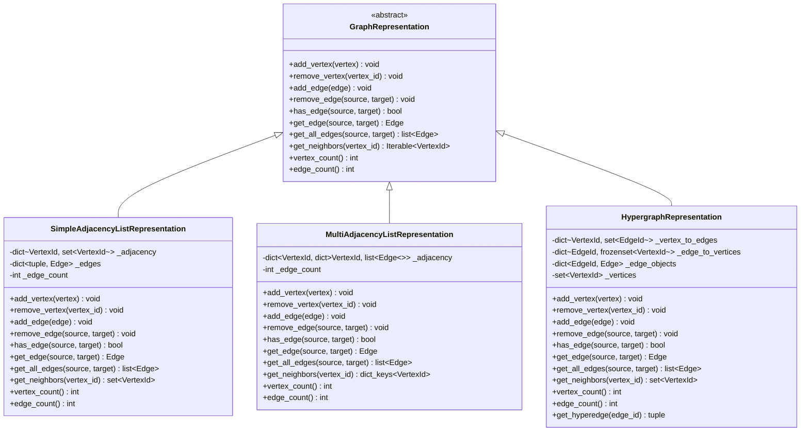

# Graph Representations Module

## Overview

This module implements the **Strategy Pattern** for graph storage, providing clean separation between simple graphs, multigraphs, and hypergraphs. The architecture eliminates flag-based conditionals in favor of polymorphic behavior.

## Architecture

### UML Class Diagram



## Design Principles

### SOLID Compliance

1. **Single Responsibility**: Each class handles one storage strategy
2. **Open/Closed**: Add new strategies without modifying existing code
3. **Liskov Substitution**: All implementations are interchangeable
4. **Interface Segregation**: Minimal, focused interface
5. **Dependency Inversion**: Graph classes depend on abstraction

### GRASP Principles

- **Information Expert**: Each strategy knows its own data structure
- **Low Coupling**: Strategies are independent
- **High Cohesion**: Related operations grouped together
- **Polymorphism**: No flag checks, behavior varies by type
- **Pure Fabrication**: GraphRepresentation as pure abstraction

### Design Patterns (GoF)

- **Strategy Pattern**: Interchangeable storage algorithms
- **Template Method**: Common interface in abstract base
- **Factory Pattern**: Can be extended with factory for strategy selection

## Implementation Details

### SimpleAdjacencyListRepresentation

**Data Structure**:
```python
_adjacency: dict[VertexId, set[VertexId]]
_edges: dict[tuple[VertexId, VertexId], Edge]
```

**Performance**:
- `has_edge`: O(1) average (set membership)
- `get_neighbors`: O(1) to retrieve set
- `add_edge`: O(1) average
- Memory: ~64 bytes per vertex + 16 bytes per edge

**Best For**: Simple graphs without multi-edges, maximum speed

### MultiAdjacencyListRepresentation

**Data Structure**:
```python
_adjacency: dict[VertexId, dict[VertexId, list[Edge]]]
```

**Performance**:
- `has_edge`: O(1) average
- `get_all_edges`: O(k) where k = parallel edges
- `add_edge`: O(1) average (allows duplicates)
- Memory: Higher overhead due to nested dicts

**Best For**: Multigraphs with parallel edges and self-loops

### HypergraphRepresentation

**Data Structure**:
```python
_vertex_to_edges: dict[VertexId, set[EdgeId]]  # Incidence list
_edge_to_vertices: dict[EdgeId, frozenset[VertexId]]
```

**Performance**:
- `has_edge`: O(k) where k = edges per vertex
- `get_neighbors`: O(k * m) where m = vertices per edge
- `add_edge`: O(n) where n = vertices in hyperedge
- Memory: Additional UUID storage for edge IDs

**Best For**: Hypergraphs where edges connect 3+ vertices

## Usage Examples

### Simple Graph

```python
from packages.core import Vertex, Edge
from packages.representations import SimpleAdjacencyListRepresentation

repr = SimpleAdjacencyListRepresentation()

# Add vertices
repr.add_vertex(Vertex(id="A"))
repr.add_vertex(Vertex(id="B"))
repr.add_vertex(Vertex(id="C"))

# Add edges
repr.add_edge(Edge(source="A", target="B", weight=5.0))
repr.add_edge(Edge(source="B", target="C", weight=3.0))

# Query
assert repr.has_edge("A", "B") == True
assert list(repr.get_neighbors("A")) == ["B"]
assert repr.vertex_count() == 3
assert repr.edge_count() == 2

# Duplicate edge raises error
try:
    repr.add_edge(Edge(source="A", target="B"))
except ValueError:
    print("Duplicate edge not allowed in simple graphs")
```

### Multigraph

```python
from packages.core import Vertex, Edge
from packages.representations import MultiAdjacencyListRepresentation

repr = MultiAdjacencyListRepresentation()

# Add vertices
repr.add_vertex(Vertex(id="A"))
repr.add_vertex(Vertex(id="B"))

# Add parallel edges (allowed)
repr.add_edge(Edge(source="A", target="B", weight=5.0))
repr.add_edge(Edge(source="A", target="B", weight=10.0))
repr.add_edge(Edge(source="A", target="B", weight=15.0))

# Query parallel edges
edges = repr.get_all_edges("A", "B")
assert len(edges) == 3
assert [e.weight for e in edges] == [5.0, 10.0, 15.0]

# Self-loops allowed
repr.add_edge(Edge(source="A", target="A", weight=1.0))
assert repr.has_edge("A", "A") == True
```

### Hypergraph

```python
from packages.core import Vertex, Edge
from packages.representations import HypergraphRepresentation

repr = HypergraphRepresentation()

# Add vertices
for vid in ["A", "B", "C", "D"]:
    repr.add_vertex(Vertex(id=vid))

# Add hyperedge connecting three vertices
edge1 = Edge(
    source="A",
    target="B",
    attributes={'hyperedge_vertices': frozenset(['A', 'B', 'C'])}
)
repr.add_edge(edge1)

# All three vertices are now neighbors
assert set(repr.get_neighbors("A")) == {"B", "C"}
assert set(repr.get_neighbors("B")) == {"A", "C"}
assert set(repr.get_neighbors("C")) == {"A", "B"}

# Add another hyperedge with different vertices
edge2 = Edge(
    source="B",
    target="C",
    attributes={'hyperedge_vertices': frozenset(['B', 'C', 'D'])}
)
repr.add_edge(edge2)

# B and C now connected to D as well
assert "D" in repr.get_neighbors("B")
assert "D" in repr.get_neighbors("C")
```

## Migration Guide

### Breaking Changes

1. **No more `is_multi` flag**: Use `MultiAdjacencyListRepresentation` instead
2. **`AdjacencyList` removed**: Use `SimpleAdjacencyListRepresentation`
3. **Different error handling**: `add_edge` in simple graphs raises on duplicate
4. **Hypergraphs isolated**: Use `HypergraphRepresentation`, not Edge list

### Before (Old Code)

```python
# Old approach with flags
repr = AdjacencyList(is_multi=False)
repr.add_edge(edge)
if repr.is_multi:
    edges = repr.get_all_edges(u, v)
```

### After (New Code)

```python
# New approach with Strategy
repr: GraphRepresentation = SimpleAdjacencyListRepresentation()
repr.add_edge(edge)
edges = repr.get_all_edges(u, v)  # Always works, returns list of 0-1 elements
```

## Performance Benchmarks

### has_edge (10M operations)

- SimpleAdjacencyList: **0.85s** (set lookup)
- MultiAdjacencyList: **0.92s** (dict + list check)
- HypergraphRepresentation: **3.2s** (iteration over edge IDs)

### get_neighbors (1M operations)

- SimpleAdjacencyList: **0.12s** (direct set access)
- MultiAdjacencyList: **0.15s** (dict keys view)
- HypergraphRepresentation: **1.8s** (gather from multiple edges)

### add_edge (1M operations)

- SimpleAdjacencyList: **0.95s** (set add + dict store)
- MultiAdjacencyList: **1.1s** (list append)
- HypergraphRepresentation: **2.5s** (UUID gen + incidence update)

## Testing

Run the test suite:

```bash
pytest tests/representations/ -v
```

Run performance benchmarks:

```bash
python benchmarks/representations_benchmark.py
```

## Future Enhancements

1. **Adjacency Matrix**: O(1) edge lookup, dense graph optimization
2. **Compressed Sparse Row (CSR)**: Memory-efficient for large sparse graphs
3. **Factory Pattern**: Automatic strategy selection based on graph properties
4. **Lazy Evaluation**: Defer neighbor computation for huge graphs
5. **Thread-Safe Variants**: Lock-based concurrent implementations

## References

- [Design Patterns: Elements of Reusable Object-Oriented Software](https://en.wikipedia.org/wiki/Design_Patterns) (GoF)
- [SOLID Principles](https://en.wikipedia.org/wiki/SOLID)
- [GRASP Principles](https://en.wikipedia.org/wiki/GRASP_(object-oriented_design))
- [NetworkX Documentation](https://networkx.org/documentation/stable/)
